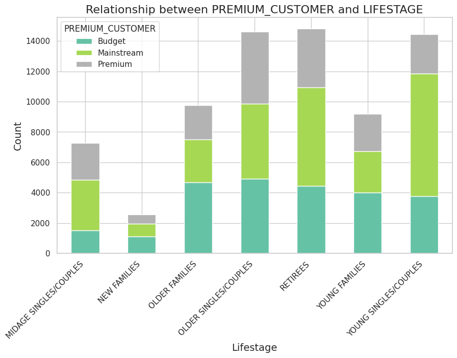
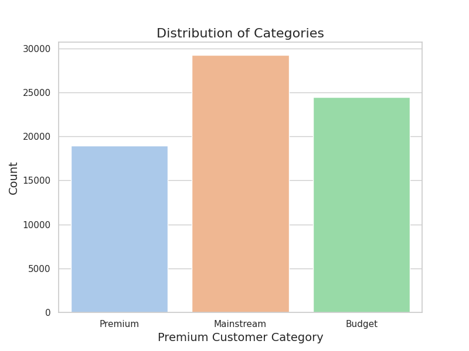
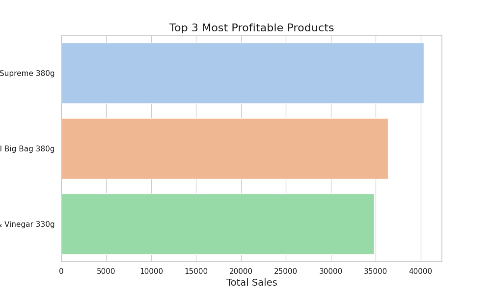
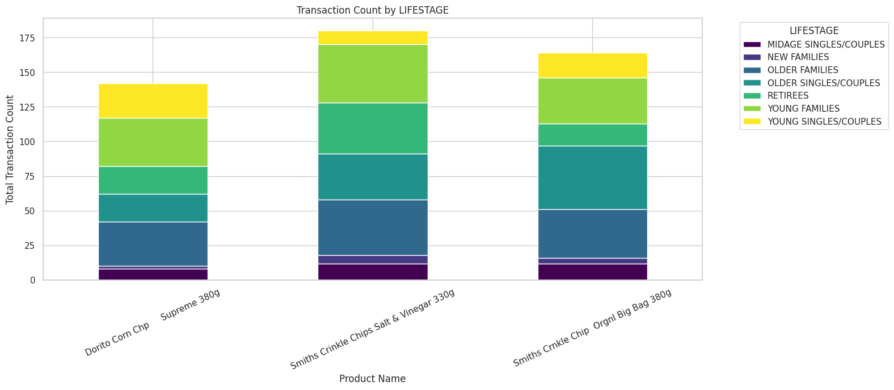
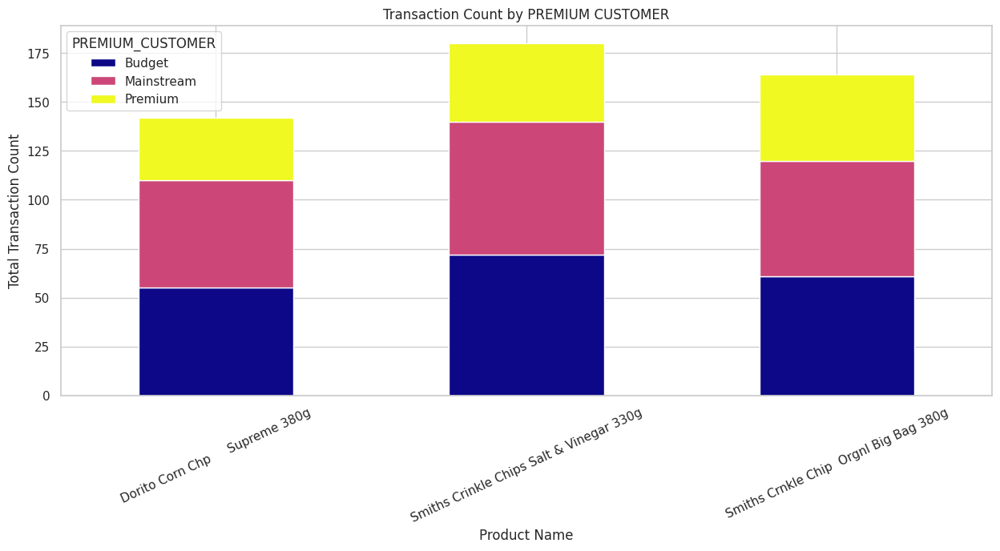

# Ignosis Hiring ML Task

## Team Member:
- Jyotin Goel

## Task 1: Who are the most profitable customers

1. **Premium Customers**:
   - The largest proportion of **Premium** customers belongs to the **OLDER SINGLES/COUPLES** group, indicating that this lifestage is the most significant for this customer category.
   - The second-largest group of **Premium** customers is **RETIREES**, suggesting that older individuals and retirees are more likely to opt for premium offerings.

2. **Mainstream Customers**:
   - The **Mainstream** customer segment is dominated by **YOUNG SINGLES/COUPLES**, highlighting that younger individuals and couples are the primary target for mainstream products or services.

3. **Budget Customers**:
   - The majority of **Budget** customers are concentrated in the **OLDER FAMILIES**, **OLDER SINGLES/COUPLES**, and **RETIREES** lifestages. This indicates that older individuals and families are more likely to prioritize budget-friendly options.
---

  
  

### Key Observations:
- **OLDER SINGLES/COUPLES** are a significant group across all customer segments, particularly for **Premium** and **Budget** categories.
- **YOUNG SINGLES/COUPLES** are the primary drivers of the **Mainstream** segment, reflecting their preference for mid-tier offerings.
- **RETIREES** are more prominent in the **Premium** and **Budget** categories, suggesting a polarization in their purchasing behavior—either opting for premium products or seeking budget-conscious options.

## Task 2: Top 3 Most Profitable Products and Characteristics of the most loyal customers

### **1. Dorito Corn Chp Supreme 380g**  
- **Premium Customer Segmentation:**  
  - The **Budget** and **Mainstream** segments contribute equally (55 transactions each), while the **Premium** segment has fewer transactions (32).  
  - This suggests that this product is **more popular among cost-conscious shoppers** rather than premium customers.  

- **Lifestage Segmentation:**  
  - The highest transactions come from **Young Families (35 transactions)** and **Older Families (32 transactions)**, indicating that this product is **favored by families with children.**  
  - Significant purchases also come from **Young Singles/Couples (25)** and **Older Singles/Couples (20)**, meaning it appeals across generations.  
  - **New Families (2 transactions)** are the least engaged with this product.  

🔍 **Key Buyer Characteristics:**  
- **Young and older families are the biggest buyers**, possibly due to shared snacking habits.  
- **Price-sensitive customers dominate purchases**, with Budget and Mainstream customers making up most of the transactions.  

---
### **2. Smiths Crinkle Chips Salt & Vinegar 330g**  
- **Premium Customer Segmentation:**  
  - Budget (72) and Mainstream (68) customers buy this product almost equally, while Premium customers (40) also contribute significantly.  
  - Compared to Doritos, **this product has more Premium customer engagement**, suggesting it has broader appeal across income levels.  

- **Lifestage Segmentation:**  
  - **Young Families (42 transactions) and Older Families (40 transactions) are the primary consumers**, reinforcing the trend that **families love this flavor.**  
  - **Older Singles/Couples (33 transactions) and Retirees (37 transactions) are also key buyers,** making this product a strong favorite among older consumers.  
  - **New Families (6 transactions) have the least interest in this product.**  

🔍 **Key Buyer Characteristics:**  
- **Appeals to all customer tiers (Budget, Mainstream, and Premium), making it a widely accepted product.**  
- **Popular among older and young families**, as well as **retirees**, indicating a preference across age groups.  

---

### **3. Smiths Crinkle Chip Original Big Bag 380g**  
- **Premium Customer Segmentation:**  
  - Budget (61) and Mainstream (59) customers dominate purchases, while Premium (44) also has strong engagement.  
  - The Premium segment purchases this product **more than the previous two chips**, showing that **it has better traction among higher-spending customers.**  

- **Lifestage Segmentation:**  
  - **Older Singles/Couples (46 transactions) make up the highest buyer group**, meaning that **this product resonates well with an older demographic.**  
  - **Older Families (35), Young Families (33), and Retirees (16) also contribute significantly.**  
  - **New Families (4 transactions) contribute the least, once again showing that newly established households do not frequently buy large chip packs.**  

🔍 **Key Buyer Characteristics:**  
- **Older consumers (Older Singles/Couples and Retirees) prefer this product,** likely due to a nostalgic connection or preference for larger packs.  
- **Has better traction among Premium customers** than the previous two products.  
- **Still maintains strong sales among Budget and Mainstream buyers.**  
---

  
  
  

### **Overall Characteristics of Top Buyers**
- **Budget & Mainstream Customers drive sales** across all three products, suggesting that pricing plays a crucial role in purchasing decisions.  
- **Families (both young and old) are major consumers,** reinforcing that snacks are commonly shared within households.  
- **Older Singles/Couples and Retirees engage heavily in purchasing the Smiths Crinkle Chips Original,** possibly due to an established brand preference.  
- **Premium Customers engage more with Smiths Crinkle Chip Original Big Bag 380g compared to Doritos,** which indicates that they may prefer classic, recognizable flavors over flavored variants.  